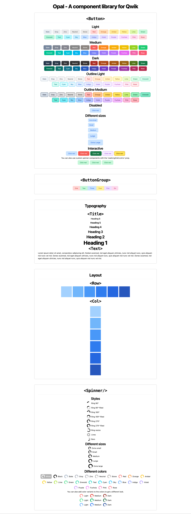

# Opal - Component library (stalled)

The main reasons that the project is stalled are:

1. Typescript type definitions didn't work after importing the components in the frontend.
2. TailwindCSS didn't generate the CSS for the components in build time.

### Full preview

